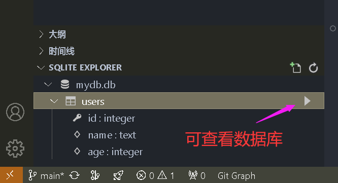

# SQLite 基本操作

- vscode 插件：SQLite
- shitf + ctrl + p 打开命令面板，SQLite: open database
- 左侧底部出现 SQLITE EXPLORER 面板，可以直接在里面进行数据库操作。



## 1.创建数据库和表

- 在 SQLite 中，数据库是通过文件来存储的。如果文件不存在，SQLite 会自动创建它。

### 创建数据库和表格

```javascript
const sqlite3 = require('sqlite3').verbose();
const path = require('path');

// 创建或打开数据库
const db = new sqlite3.Database('mydb.db', (err) => {
  if (err) {
    console.error('Error opening database:', err);
  } else {
    console.log('Database created or opened successfully!');
  }
});

// 获取当前目录的子目录 "data" 路径, 指定db文件路径
// const dbPath = path.join(__dirname, 'data', 'mydb.db');

// // 创建数据库并指定路径
// const db = new sqlite3.Database(dbPath, (err) => {
//   if (err) {
//     console.error('Error opening database:', err);
//   } else {
//     console.log('Database created or opened successfully at', dbPath);
//   }
// });

// 创建一个 "users" 表
db.run(`CREATE TABLE IF NOT EXISTS users (
  id INTEGER PRIMARY KEY AUTOINCREMENT,
  name TEXT NOT NULL,
  age INTEGER NOT NULL
)`, (err) => {
  if (err) {
    console.error('Error creating table:', err);
  } else {
    console.log('Table "users" created successfully!');
  }
});

```

## 2. 插入数据

- 可以使用 INSERT INTO 语句插入数据。

### 插入单条数据

```javascript
// 插入单条数据
const stmt = db.prepare('INSERT INTO users (name, age) VALUES (?, ?)');

// 插入一行数据
stmt.run('Alice', 30);
stmt.run('Bob', 25);
stmt.run('Charlie', 35);

stmt.finalize(); // 完成插入操作
```

### 插入多条数据

```javascript
// 插入多条数据
const insertData = db.prepare('INSERT INTO users (name, age) VALUES (?, ?)');

insertData.run('David', 40);
insertData.run('Eva', 28);
insertData.finalize();
```

## 3. 查询数据

- 使用 SELECT 语句来查询数据，可以选择特定的列或查询所有数据。

### 查询所有用户数据

```javascript
// 查询所有用户数据
db.all('SELECT * FROM users', [], (err, rows) => {
  if (err) {
    throw err;
  }
  console.log('All users:', rows);
});

```

### 查询特定用户

```javascript
// 查询指定用户数据
db.get('SELECT * FROM users WHERE name = ?', ['Alice'], (err, row) => {
  if (err) {
    throw err;
  }
  console.log('User found:', row);
});
```

## 4. 更新数据

- 使用 UPDATE 语句更新现有的数据。

```javascript
// 更新用户数据
db.run('UPDATE users SET age = ? WHERE name = ?', [32, 'Alice'], function(err) {
  if (err) {
    console.error('Error updating data:', err);
  } else {
    console.log(`Updated ${this.changes} row(s)`);
  }
});
```

## 5. 删除数据

- 使用 DELETE 语句删除数据

```javascript
// 删除用户数据
db.run('DELETE FROM users WHERE name = ?', ['Bob'], function(err) {
  if (err) {
    console.error('Error deleting data:', err);
  } else {
    console.log(`Deleted ${this.changes} row(s)`);
  }
});
```

## 6. 关闭数据库

- 在操作完成后，应该关闭数据库连接。

```javascript
// 关闭数据库连接
db.close((err) => {
  if (err) {
    console.error('Error closing database:', err);
  } else {
    console.log('Database closed successfully');
  }
});
```

## 7. 完整示例：管理一个简单的用户表

- 下面是一个完整的示例，包含创建数据库、表格、插入数据、查询数据、更新和删除数据。

```javascript
const sqlite3 = require('sqlite3').verbose();

// 创建数据库文件
const db = new sqlite3.Database('mydb.db', (err) => {
  if (err) {
    console.error('Error opening database:', err);
  } else {
    console.log('Database created or opened successfully!');
  }
});

// 创建表格
db.run(`CREATE TABLE IF NOT EXISTS users (
  id INTEGER PRIMARY KEY AUTOINCREMENT,
  name TEXT NOT NULL,
  age INTEGER NOT NULL
)`, (err) => {
  if (err) {
    console.error('Error creating table:', err);
  } else {
    console.log('Table created successfully!');
  }
});

// 插入数据
const stmt = db.prepare('INSERT INTO users (name, age) VALUES (?, ?)');
stmt.run('Alice', 30);
stmt.run('Bob', 25);
stmt.run('Charlie', 35);
stmt.finalize();

// 查询所有数据
db.all('SELECT * FROM users', [], (err, rows) => {
  if (err) {
    throw err;
  }
  console.log('All users:', rows);
});

// 更新数据
db.run('UPDATE users SET age = ? WHERE name = ?', [32, 'Alice'], function(err) {
  if (err) {
    console.error('Error updating data:', err);
  } else {
    console.log(`Updated ${this.changes} row(s)`);
  }
});

// 删除数据
db.run('DELETE FROM users WHERE name = ?', ['Bob'], function(err) {
  if (err) {
    console.error('Error deleting data:', err);
  } else {
    console.log(`Deleted ${this.changes} row(s)`);
  }
});

// 关闭数据库
db.close((err) => {
  if (err) {
    console.error('Error closing database:', err);
  } else {
    console.log('Database closed successfully');
  }
});
```

## 总结

- SQLite 使用非常简单，只需通过 SQL 语句创建数据库、表格、插入、查询、更新和删除数据。在 Node.js 中使用 SQLite 时，你可以通过 sqlite3 模块来执行这些操作。根据需求，你可以选择将 SQL 语句直接嵌入代码中，或者使用更复杂的查询和数据处理方式。